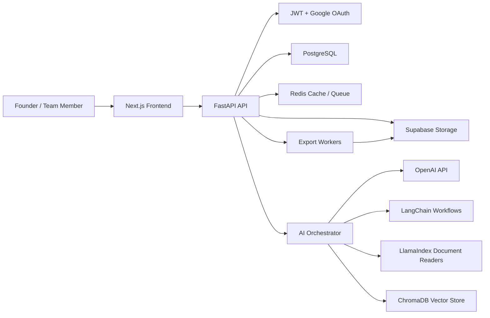
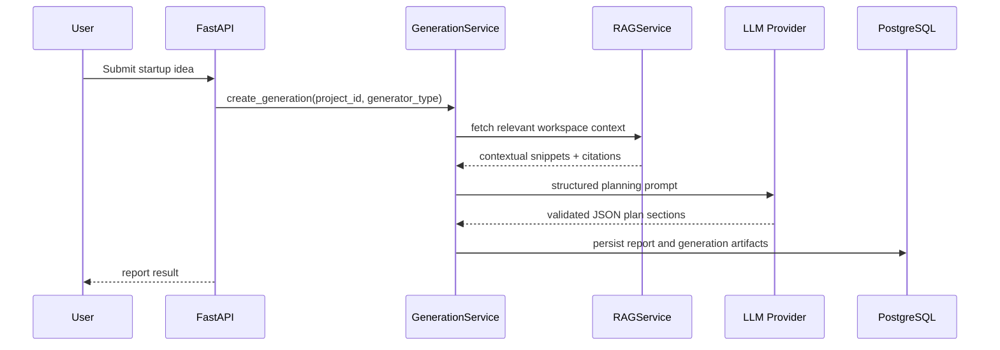

# StartupPilot AI Architecture

StartupPilot AI is a multi-tenant SaaS platform that turns a founder's startup idea into a complete MVP execution plan. The system combines deterministic planning workflows, LLM generation, document-grounded RAG, export services, and role-based collaboration.

## System Goals

- Generate complete startup plans from a short idea.
- Support project workspaces with saved reports, document libraries, team members, billing, and AI chat.
- Ground AI answers in uploaded PDFs, pitch decks, Word files, and Excel files.
- Export reports to PDF, Markdown, Word, PowerPoint, and JSON.
- Scale to thousands of users with clean service boundaries, caching, observability, and asynchronous processing.

## High-Level Architecture

## Backend Layers

- `api`: FastAPI routers and request/response boundary.
- `schemas`: Pydantic DTOs for validation.
- `services`: Business use cases such as project creation, generation, chat, exports, billing, and document ingestion.
- `repositories`: SQLAlchemy persistence adapters.
- `models`: SQLAlchemy ORM entities.
- `core`: configuration, logging, security, dependency injection, exceptions.
- `workers`: background jobs for embeddings, export generation, and long-running plan creation.

## AI Pipeline

## RAG Ingestion

1. User uploads a document.
2. Backend validates MIME type, size, tenant access, and project ownership.
3. Original file is stored in Supabase Storage.
4. A background ingestion job extracts text with LlamaIndex readers.
5. Text is chunked, embedded, and stored in ChromaDB with tenant/project metadata.
6. Document status moves from `uploaded` to `indexed`.

## Security Model

- Multi-tenant access enforced on every repository method by `organization_id`.
- JWT access tokens are short-lived.
- Google OAuth links external identities to internal users.
- Role-based access supports Owner, Admin, Editor, Viewer.
- All AI prompts include data-boundary instructions to prevent cross-tenant leakage.
- Uploads are virus-scannable extension points before indexing.
- Audit logs capture login, project access, generation, export, and billing events.

## Generator Types

- Business Plan Generator
- Lean Canvas Generator
- Marketing Plan Generator
- Roadmap Generator
- Pitch Deck Generator
- Database Generator
- API Generator
- Architecture Generator
- Tech Stack Generator
- Investor Readiness Score

## Export Pipeline

Exports are asynchronous. Requests create an export job, workers render the selected format, upload the artifact to storage, and update the export record with a signed URL.

## Deployment

- Frontend: Vercel
- Backend: Railway container service
- PostgreSQL: Railway managed PostgreSQL
- Redis: Railway managed Redis
- Storage: Supabase Storage
- CI/CD: GitHub Actions
- Containerization: Docker Compose for local development and production-compatible Dockerfiles

## Observability

- Structured JSON logs.
- Request IDs on every API request.
- Error responses use stable error codes.
- Generation jobs include prompt/version/model metadata.
- Export and ingestion jobs include duration and failure reason.

